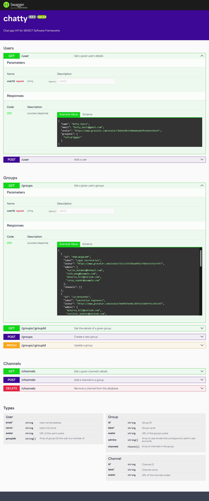

# Chatty

Phase 1 of a chat application for 3813ICT Software Frameworks at Griffith University.

## Table of contents
- [Overview](#overview)
  - [Data structure](#data-structure)
  - [API endpoints and associated functions](#api-endpoints-and-associated-functions)
- [Server](#server)
  - [Installation and local development](#installation-and-local-development)
  - [Interactive documentation](#interactive-documentation)
  - [Mock data generation](#mock-data-generation)
- [Front-end](#front-end)
  - [Installation and local development](#installation-and-local-development-1)
  - [Navigation structure](#navigation-structure)
  - [UI prototype screenshots](#ui-prototype-screenshots)

---
## Overview

**Chatty** is a chat application that will allow users with super admin privileges to create groups. Within these groups are channels which users in the group can join and chat in at any time.

### Data structure

The data requirements are as follows:
- A user can be a member of multiple groups
- A user can have different roles in different groups - chat user or group admin 
- A group can have multiple users
- A group can have multiple channels
- Each channel belongs to exactly one group. 

In Phase 2, the requirements specify that we will implement a NoSQL database (MongoDB) to store user, group, and channel data. To me, the data is inherently relational, so developing a data structure that would not risk duplicate data and orphaned records was a challenge.

The below diagram visualises the data structure I have developed accordingly:

` 

#### Related links:
- [Original diagram](https://www.figma.com/board/1AIsEvGFkMVhqiMuMNNSE4/3813ICT?node-id=0-1&t=mioMbQlxrygdLFyQ-1)
- [TypeScript types file](./server/src/types.ts)

In a relational database, constraints such as requiring a channel belong to exactly one valid group, a group's link to its users being removed when the group is deleted, and similar behaviours could be enforced at the database level using commands like `[key] REFERENCES [other table's field]` for linking relationships, and `ON DELETE CASCADE` for preventing orphaned data.

The constraint of making this work in a JSON-like structure meant I had to implement logic at the code level to ensure data integrity. I did this by creating REST API endpoints for all valid interactions.

### API endpoints and associated functions

| Method and endpoint | Parameters     | Function                                                                         |
|---------------------|----------------|----------------------------------------------------------------------------------|
| `GET /user`         | User ID        | Get the details of a given user.                                                 |
| `POST /user`        | User object    | Create a new user.                                                               |
| `GET /groups`       | User ID        | Get the groups a user belongs to.                                                |
| `GET /group`        | Group ID       | Get the details of a given group, including its channels and admins.             |
| `POST /group`       | Group object   | Create a new group.                                                              |
| `PATCH /group`      | Group object   | Update an existing group. For example, to add/remove an admin user or a channel. |
| `GET /channel`      | Channel ID     | Get the details of a given channel.                                              |
| `POST /channel`     | Channel object | Create a new channel.                                                            |
| `DELETE /channel`   | Channel ID     | Delete a channel.                                                                |


---

## Server
The server is a Node.js application that uses Express.js to serve a RESTful API. The server is responsible for managing users, groups, and channels. For the purposes of Phase 1, data is currently stored in JSON files. 

### Installation and local development

Install dependencies:

```bash
cd server
npm install
```

Run the server in development mode (uses Nodemon to watch for changes):
```bash
npm run dev
```

### Interactive documentation
I have used [express-jsdoc-swagger](https://www.npmjs.com/package/express-jsdoc-swagger) to generate web-based documentation of the API. The documentation can be accessed at `http://localhost:4100/docs` when the server is running.



### Mock data generation
I have created a script to generate mock users, groups, and channels for development and testing purposes. Generated files are included in this repository, but the generation script can be re-run using:

```bash
cd server
npm run generate
```

---
## Front-end

The front-end is an Angular application with custom UI components.

### Installation and local development

Install dependencies:

```bash
cd frontend
npm install
```

Run the front-end in development mode:
```bash
npm run start
```

### Navigation structure

The navigation structure is as follows:

[!Navigation structure diagram](./doc-assets/navigation-structure.png)
[Link to original diagram](https://www.figma.com/board/1AIsEvGFkMVhqiMuMNNSE4/3813ICT?node-id=0-1&t=mioMbQlxrygdLFyQ-1)

### UI prototype screenshots


