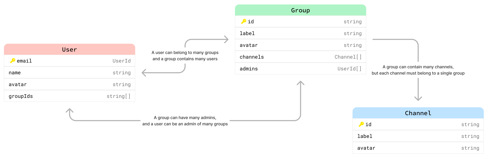
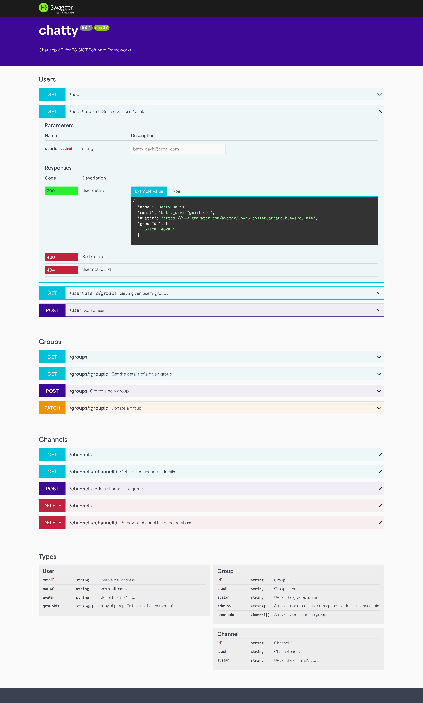
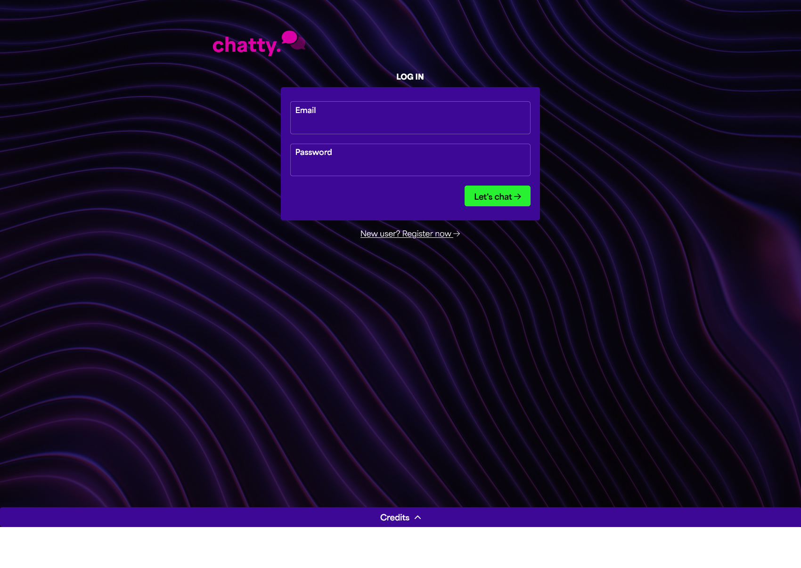
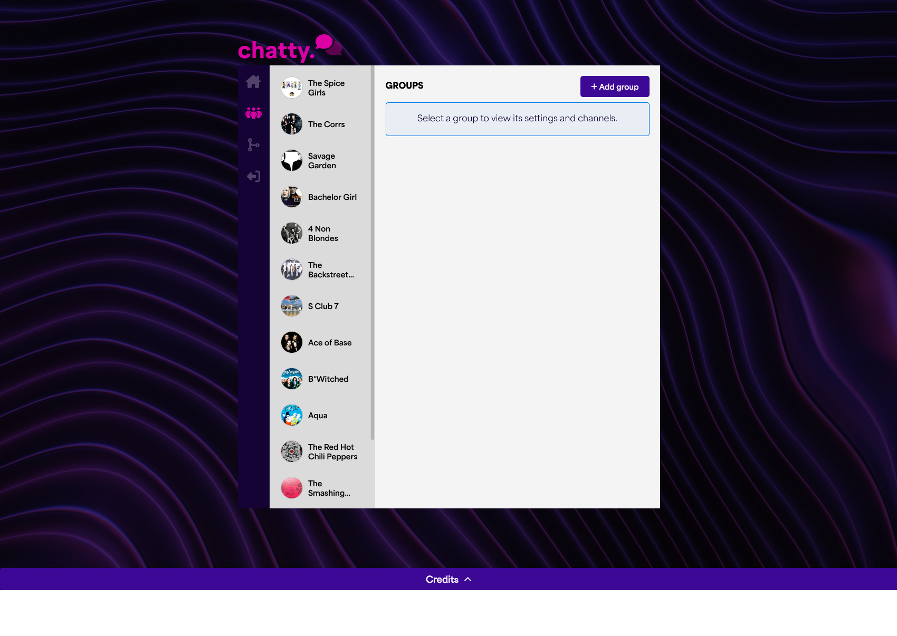
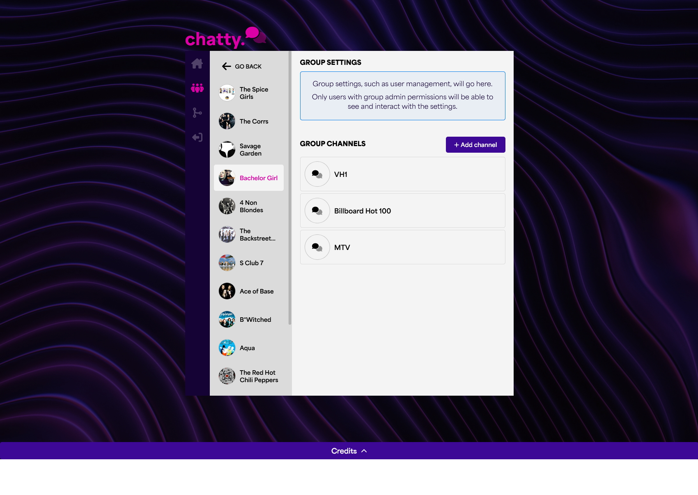
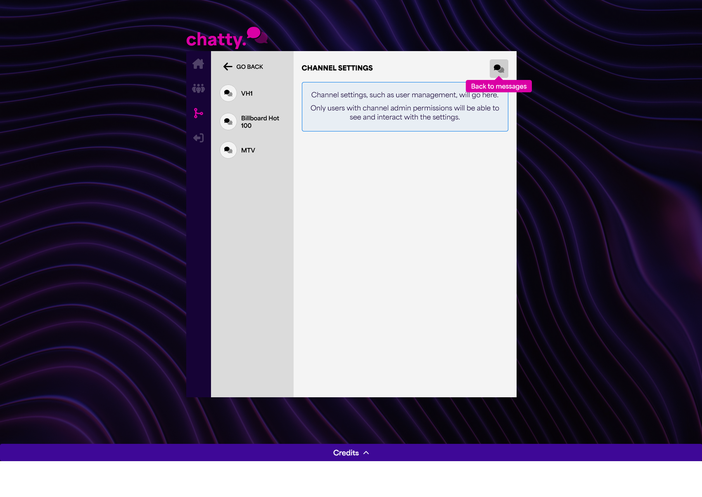

# Chatty

Chat application for 3813ICT Software Frameworks at Griffith University.

## Table of contents
- [Overview](#overview)
  - [Data structure](#data-structure)
  - [API endpoints](#api-endpoints)
- [Server](#server)
  - [Installation and local development](#installation-and-local-development)
  - [Interactive documentation](#interactive-documentation)
  - [Unit tests](#unit-tests)
  - [Mock data generation](#mock-data-generation)
- [Front-end](#front-end)
  - [Installation and local development](#installation-and-local-development-1)
  - [Navigation structure](#navigation-structure)
  - [UI prototype screenshots](#ui-prototype-screenshots)
  - [Unit tests](#unit-tests-1)

---
## Overview

**Chatty** is a chat application that will allow users with super admin privileges to create groups. Within these groups are channels which users in the group can join and chat in at any time.

### Data structure

The data requirements are as follows:
- A user can be a member of multiple groups
- A user can have different roles in different groups - chat user or group admin 
- A group can have multiple users
- A group can have multiple channels
- Each channel belongs to exactly one group. 

In Phase 2, the requirements specify that we will implement a NoSQL database (MongoDB) to store user, group, and channel data. To me, the data is inherently relational, so developing a data structure that would not risk duplicate data and orphaned records was a challenge.

The below diagram visualises the data structure I have developed accordingly:

` 

#### Related links:
- [Original diagram](https://www.figma.com/board/1AIsEvGFkMVhqiMuMNNSE4/3813ICT?node-id=0-1&t=mioMbQlxrygdLFyQ-1)
- [TypeScript types file](./server/src/types.ts)

In a relational database, constraints such as requiring a channel belong to exactly one valid group, a group's link to its users being removed when the group is deleted, and similar behaviours could be enforced at the database level using commands like `[key] REFERENCES [other table's field]` for linking relationships, and `ON DELETE CASCADE` for preventing orphaned data.

The constraint of making this work in a JSON-like structure meant I had to implement logic at the code level to ensure data integrity. I did this by creating REST API endpoints for all valid interactions.

### API endpoints

| Method and endpoint           | Parameters              | Function                                                            |
|-------------------------------|-------------------------|---------------------------------------------------------------------|
| `GET /user/:userId`           | User ID (email address) | Get the details of a given user.                                    |
| `GET /user/:userId/groups`    | User ID (email address) | Get the details of groups that the given user is a member of.       |
| `POST /user`                  | `User` object           | Create a new user.                                                  |
| `GET /groups/:groupId`        | Group ID (string)       | Get the details of a given group.                                   |
| `POST /groups`                | `Group` object          | Create a new group.                                                 |
| `PATCH /groups/:groupId`      | `Group` object          | Update an existing group, such as changing its name or admin users. |
| `GET /channels/:channelId`    | Channel ID (string)     | Get the details of a given channel.                                 |
| `POST /channels`              | `Channel` object        | Create a new channel.                                               |
| `DELETE /channels/:channelId` | Channel ID (string)     | Delete a given channel.                                             |

---

## Server
The server is a Node.js application that uses Express.js to serve a RESTful API. The server is responsible for managing users, groups, and channels in a Mongo database.

### Installation and local development

Install dependencies:

```bash
cd server
npm install
```

Run the server in development mode (uses Nodemon to watch for changes):
```bash
npm run dev
```

### Interactive documentation
I have used [express-jsdoc-swagger](https://www.npmjs.com/package/express-jsdoc-swagger) to generate web-based documentation of the API. The documentation can be accessed at `http://localhost:4100/docs` when the server is running. The documentation includes complete examples of parameters and responses for each endpoint, along with the associated type definitions.



### Unit tests

I have written unit tests for all methods in the interaction class and all REST endpoints. MongoDB needs to be running locally, but the Express server does not.

These can be run using the provided Run configuration in WebStorm/IntelliJ, or with the below command:

```bash
cd server
npm run test
```
Under the hood, this:
- Sets the `NODE_ENV` environment variable to `test` so that certain things can be skipped (notably the custom Swagger doc webpage)
- Sets up a test database populated with the mock data from the `./src/data/groups.json` and `./src/data/users.json` files
- Runs the Jest test runner with the `--coverage` flag to generate a coverage report
- Uses [SuperTest](https://www.npmjs.com/package/supertest) to test the REST API endpoints without needing to run the server.

### Mock data generation
I have created a script to generate mock users, groups, and channels for development and testing purposes. Generated files are included in this repository and are used for unit tests.

New mock data can be generated using the below command, but bear in mind that replacing the current data files will break unit tests. You may want to back up the current data files first.

```bash
cd server
npm run generate
```

---
## Front-end

The front-end is an Angular application with custom UI components.

### Installation and local development

Install dependencies:

```bash
cd frontend
npm install
```

Run the front-end in development mode:
```bash
npm run start
```

### Navigation structure

The navigation structure is as follows:

[!Navigation structure diagram](./doc-assets/navigation-structure.png)
[Link to original diagram](https://www.figma.com/board/1AIsEvGFkMVhqiMuMNNSE4/3813ICT?node-id=0-1&t=mioMbQlxrygdLFyQ-1)

### UI prototype screenshots






### Unit tests

I have written unit tests for the front-end components using Karma, Jasmine with [Jasmine DOM](https://github.com/testing-library/jasmine-dom), and [Angular Testing Library](https://testing-library.com/docs/angular-testing-library/intro). 

These can be run using the provided Run configuration in WebStorm/IntelliJ, or with the below command:

```bash
cd frontend
npm run test
```

Under the hood, this:
- Runs the Karma test runner with the `--code-coverage` flag to generate a coverage report
- Uses Jasmine with the additional [Jasmine DOM](https://github.com/testing-library/jasmine-dom) library to provide additional assertion matchers such as `.toBeVisible()`.